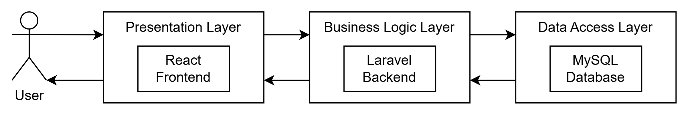
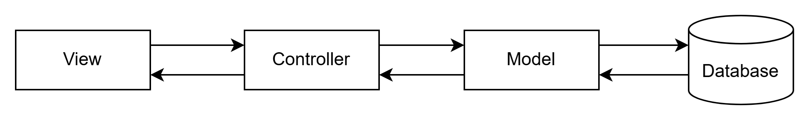
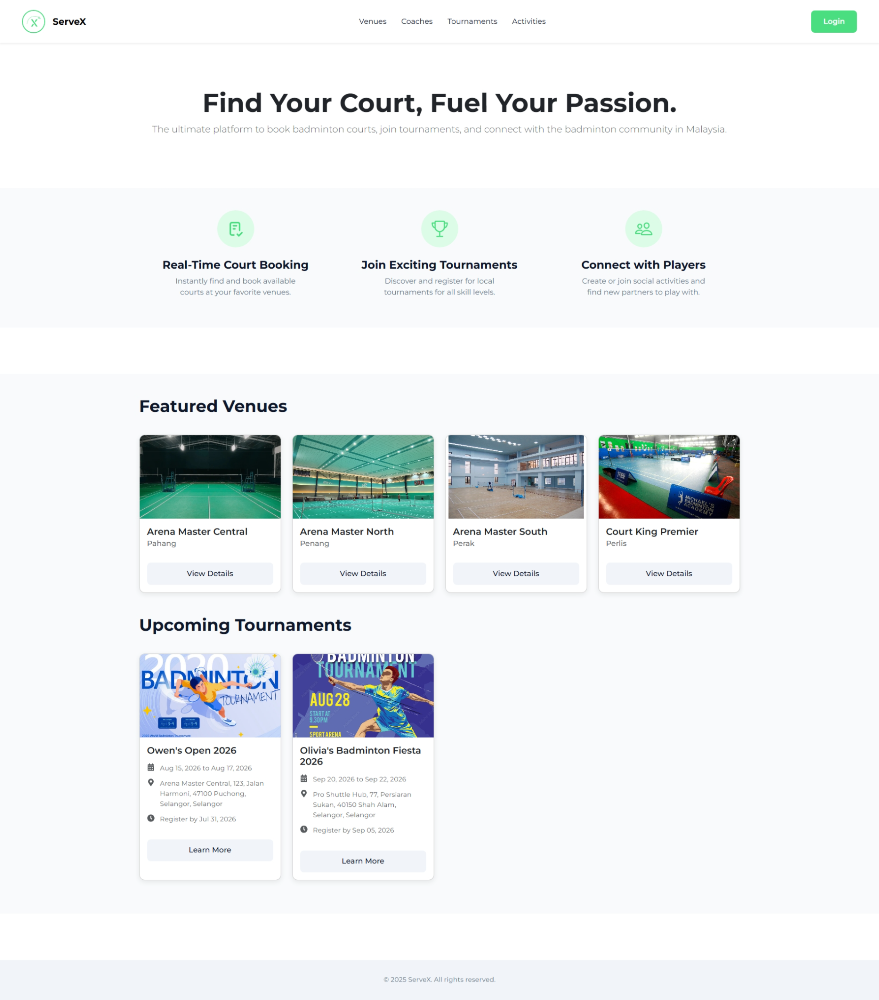
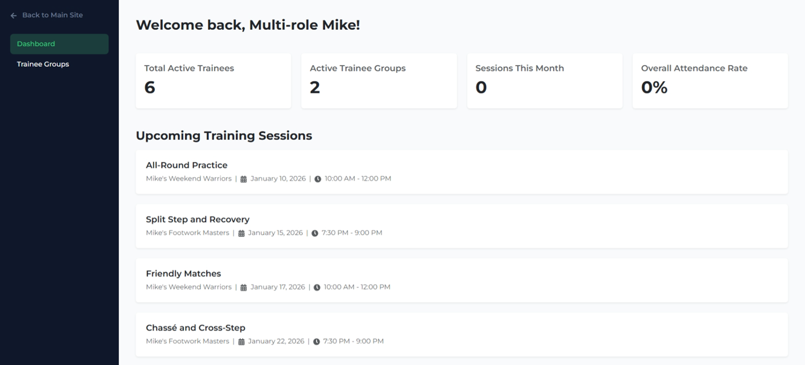
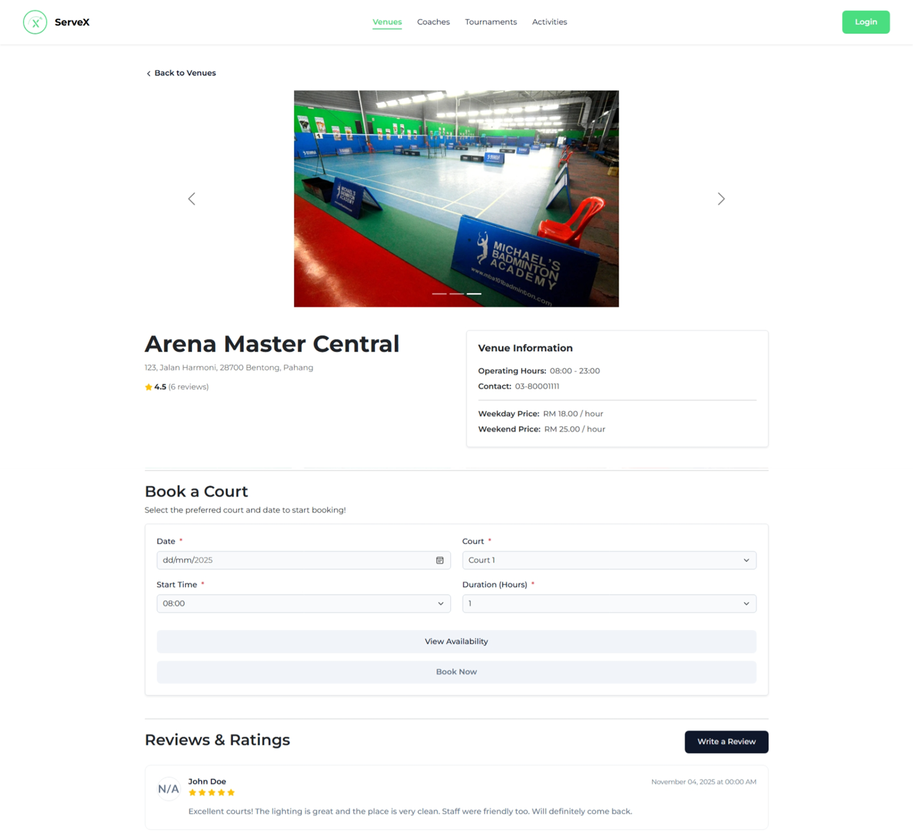
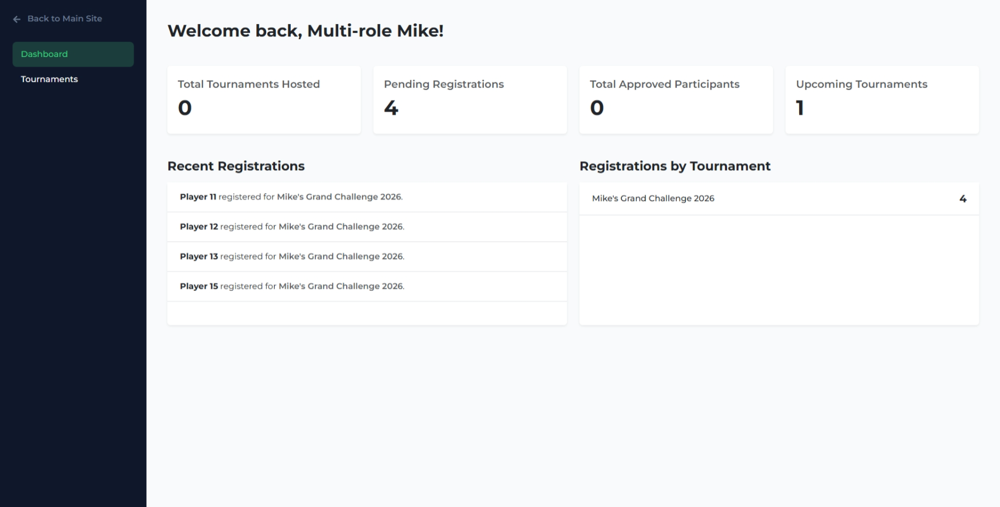
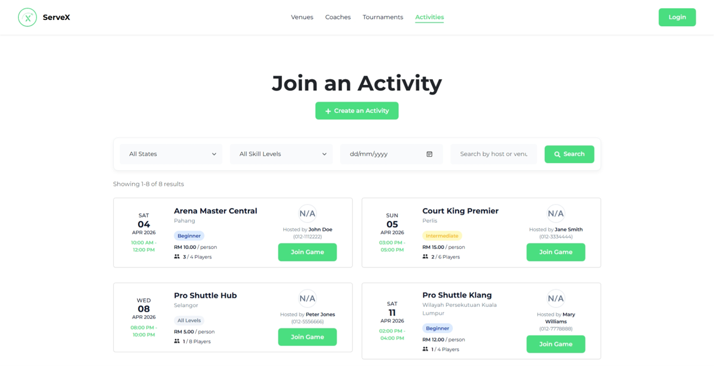
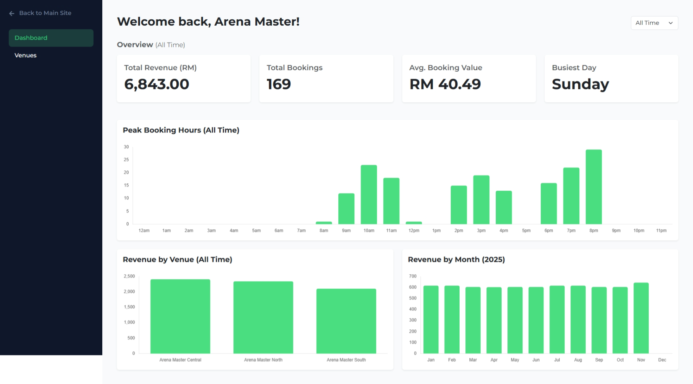
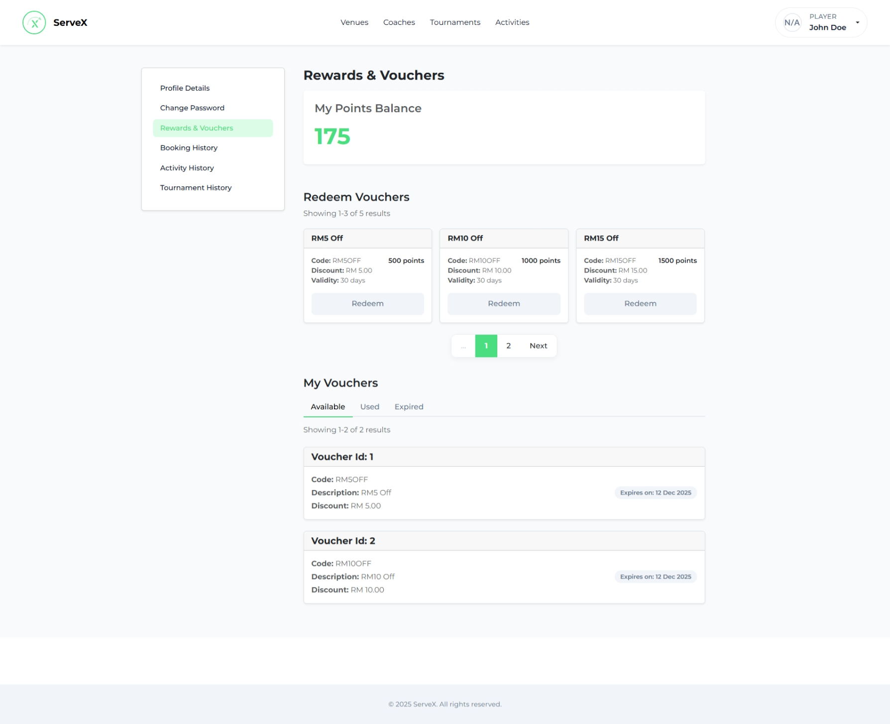
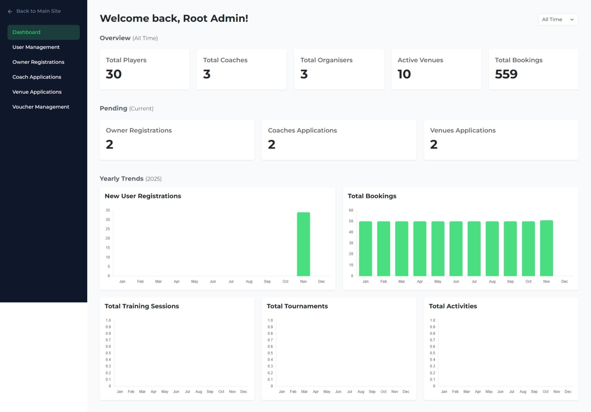

# ServeX - Badminton Management Web App

## Overview
ServeX is a comprehensive web application designed to streamline the administration of badminton facilities, coaching sessions, activities, and tournaments. Developed using React, Bootstrap, Laravel, and MySQL, the platform provides dedicated interfaces for administrators, facility owners, coaches, and players to seamlessly manage bookings, track players' performance, and participate in competitive events.

## Key Features

| Module | Capability |
| :--- | :--- |
| **User & Admin** | Account registration, profile management, user status updates, and system-wide analytics oversight. |
| **Venue Booking** | Facility creation, real-time court availability monitoring, booking, and payment processing. |
| **Coaching** | Trainee group creation, session scheduling, attendance tracking, and performance feedback. |
| **Tournaments** | Organiser pass purchasing, player registration approvals, and results publishing. |
| **Rewards & Activities** | Loyalty point accumulation, voucher redemption, and community activity coordination. |

## System Architecture

The application employs a structured **Three-Tier Architecture** to ensure scalability and maintainability by separating the system into three distinct layers:

1. **Presentation Layer (Frontend - React):** Displays the user interface and captures user input directly within the web browser.
2. **Business Logic Layer (Backend - Laravel):** Processes requests received from the Presentation Layer, applies the necessary business rules, and generates the appropriate outputs.
3. **Data Access Layer (Database - MySQL):** Handles all create, retrieve, update, and delete (CRUD) operations, ensuring data is securely stored in organised relational tables.

  

Within the Business Logic Layer, the system further utilises the **Model-View-Controller (MVC) Architecture** to handle user requests efficiently:

* **Model:** Represents the data and business logic, executing database queries securely and ensuring compliance with platform rules.
* **View:** Renders the processed data from the Model into a readable format for the user interface.
* **Controller:** Acts as the intermediary, receiving user requests, querying the Model, and directing the output for the View.

## Application Screenshots

Below is a selection of key interfaces demonstrating the user modules and core dashboards. A complete screenshot of all 60 webpages can be found in the `docs/screenshots/` directory.

| Player Interface | Dashboards |
| :---: | :---: |
| **Home Page**  | **Coach Dashboard**  |
| **Court Booking Page**  | **Organiser Dashboard**  |
| **Browse Activities Page**  | **Owner Dashboard**  |
| **Rewards and Vouchers Page**  | **Admin Dashboard**  |

## System Requirements

| Component | Requirement |
| :--- | :--- |
| **Hardware** | 64-bit architecture processor, minimum 3 GB free disk space, and minimum 4 GB RAM. |
| **Operating System** | Microsoft Windows 10 or newer. |
| **Software Environment** | Node.js v22.17.0 (LTS), Composer 2.8.10, and XAMPP 8.2.12. |
| **Development Tools** | Visual Studio Code 1.102 or newer and PHP Intelephense. |

## Installation 

Follow these sequential instructions to configure the application in your local development environment:

1. Add PHP directory as PATH environment variables.

| Operating System | Possible Directory |
| :--- | :--- |
| **Windows** | `C:/php` |
| **macOS** | `/opt/homebrew/opt/php/bin` `/usr/local/opt/php/bin` |

2. Start Apache and MySQL via the XAMPP Control Panel, then import the `servex_db.sql` file into your MySQL database using phpMyAdmin.
3. Open your command terminal, navigate to the `backend` directory, and execute `composer install`.
4. Duplicate the `.env.example` file to create a `.env` file, define your Stripe API Key on `STRIPE_SECRET`, and generate a secure application key utilising `php artisan key:generate`.
5. Start the backend server by executing `php artisan serve` and initialise the automated database tasks in a separate terminal with `php artisan schedule:work`.
6. Navigate to the `frontend` directory in a new terminal window and execute `npm install`.
7. Duplicate the `.env.local.example` file to create `.env.local`, and launch the user interface utilising `npm start`.
8. `[Optional]` To test and capture emails (E.g. Send Reset Link on the Forgot Password Page), execute `.\mailpit` in a separate terminal, and navigate to `http://localhost:8025` in a web browser.

## Default Test Credentials

You may access and evaluate the system utilising the following pre-configured profiles:

| No. | Role | Email | Password |
| :--- | :--- | :--- | :--- |
| 1. | **Admin** | admin@example.com | @Admin12345
| 2. | **Player** | john.doe@example.com | @John12345
| 3. | **Player (w/ Coach)** | carl.c@example.com | @Carl12345
| 4. | **Player (w/ Organiser Pass)** | owen.o@example.com | @Owen12345
| 5. | **Player (w/ Coach + Organiser Pass)** | mike.m@example.com | @Mike12345
| 6. | **Owner** | master@arena.com | @ArenaMaster123